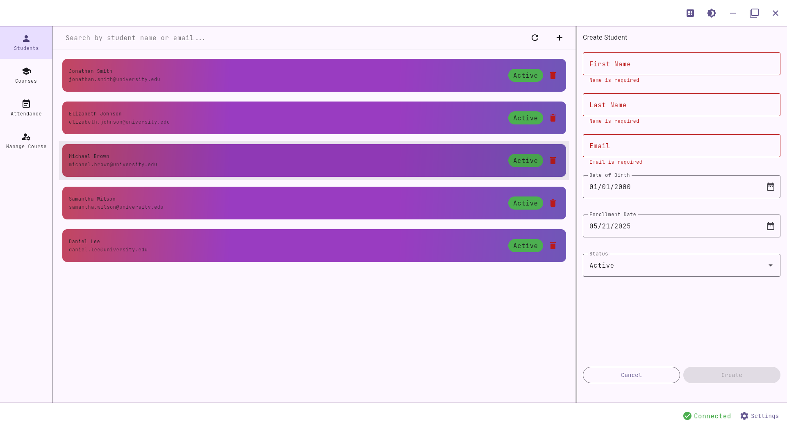
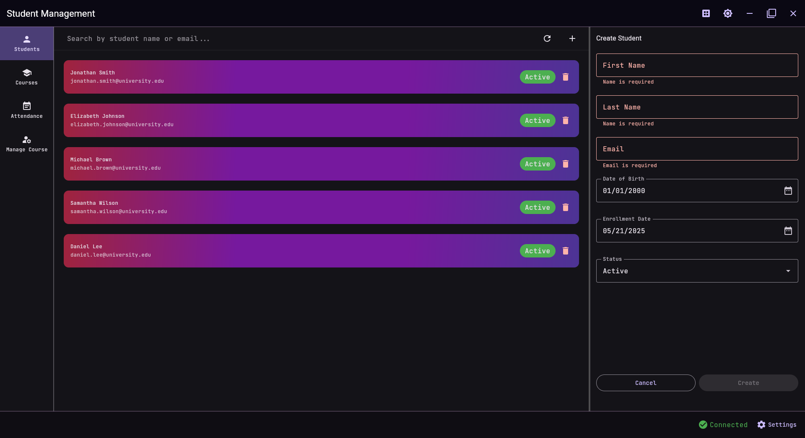
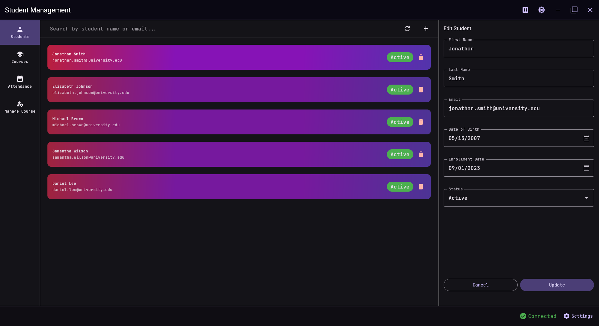
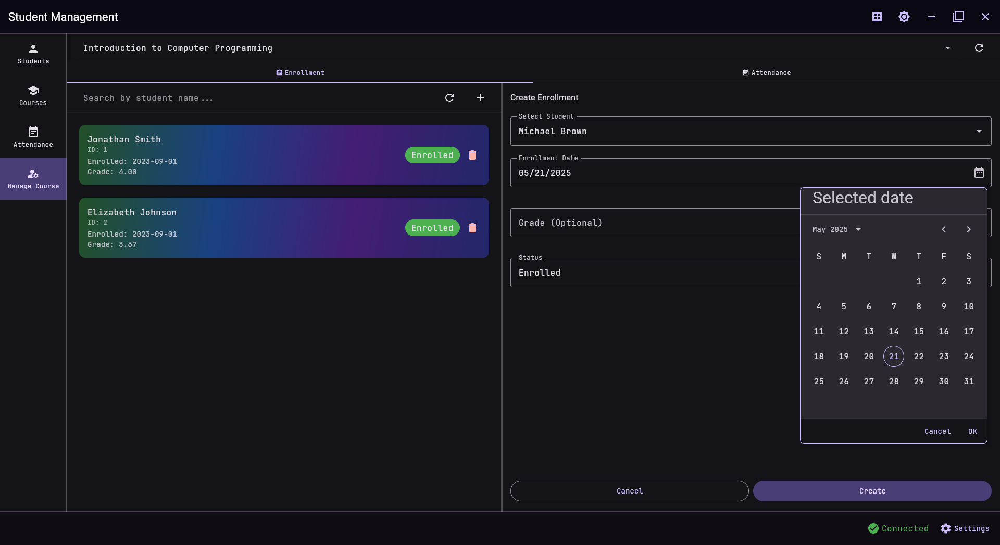
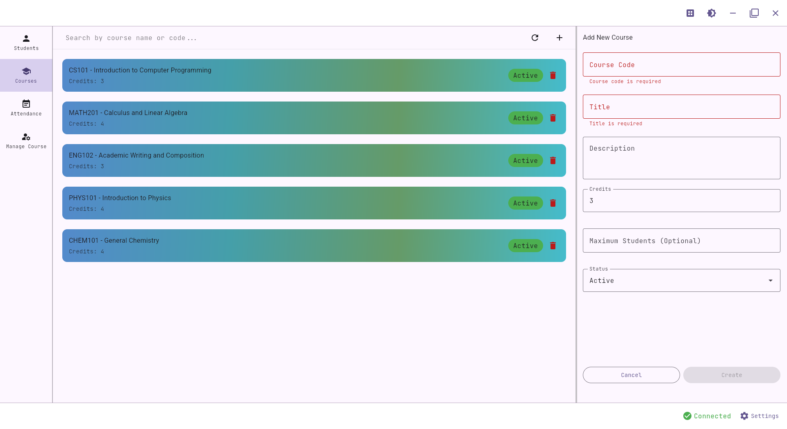
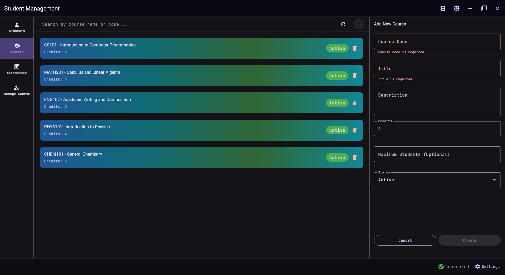
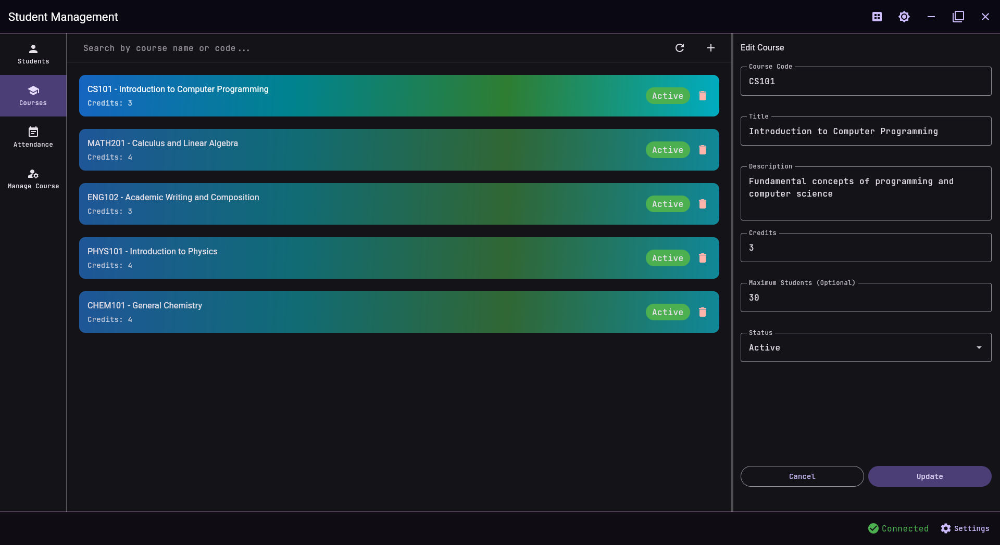
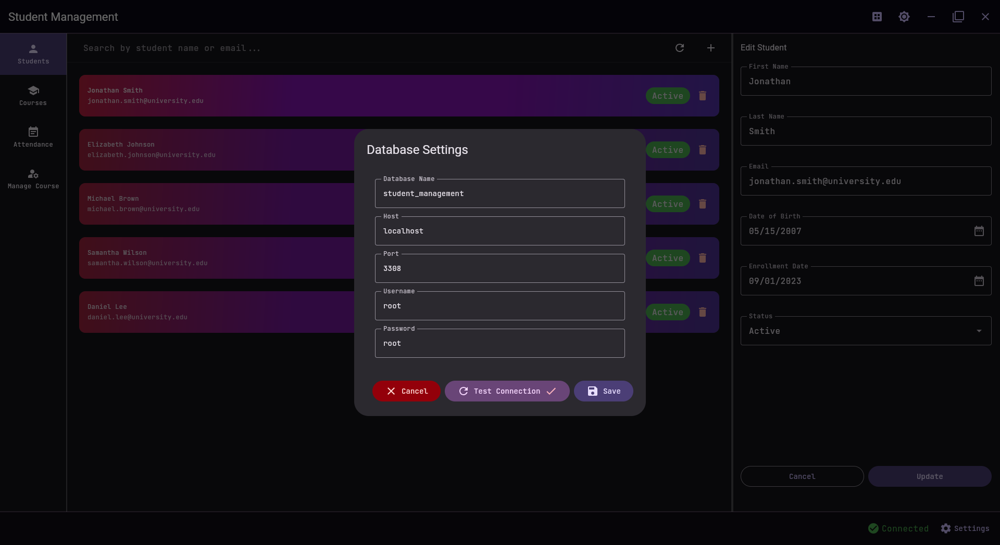
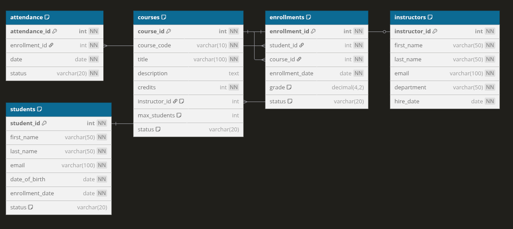

# Learning Management System (LMS)

A comprehensive learning management system built as a Database Course project, demonstrating the implementation of a full-featured educational platform with modern desktop interface using Kotlin and Compose M

> **Academic Project** - Database Course Implementation
> 
> This LMS project showcases practical implementation of essential database concepts including:
> - Relational Database Design & Modeling
> - Advanced SQL Development
> - Stored Procedures and Functions
> - Data Integrity and Constraints
> - Transaction Management
> - Educational Data Analytics

## 📸 Screenshots

### User Dashboard & Student Management
| Light Theme | Dark Theme |
|-------------|------------|
|  |  |
| Student Profile Management | Course Overview |
|  |  |

### Course Management & Academic Tools
| Light Theme | Dark Theme |
|-------------|------------|
|  |  |
| Course Editor | Database Settings |
|  |  |

## 🎨 Themes
The application supports both light and dark themes, as shown in the screenshots above. You can switch between themes in the application settings.

## 🚀 Features

### Learning Management Features
- **Course & Content Management**
  - Course creation and scheduling
  - Content organization and delivery
  - Assignment management
  - Grade tracking and assessment

- **User Management & Access Control**
  - Student enrollment system
  - Instructor management
  - Role-based access control
  - Profile management

- **Academic Tools**
  - Attendance tracking
  - Grade calculation and GPA management
  - Progress monitoring
  - Academic performance analytics

### Database Implementation
- **Advanced Schema Design**
  - Integrated user management system
  - Course content organization
  - Assessment and grading framework
  - Learning progress tracking
  - Comprehensive data relationships

- **Professional SQL Implementation**
  - Complex stored procedures for academic operations
  - Automated triggers for data consistency
  - Transaction management for data integrity
  - Custom functions for educational analytics

- Data Integrity & Validation
  - Email format validation
  - Date constraints for enrollment
  - Course code formatting rules
  - Capacity management for courses

- Modern UI with Compose Multiplatform
  - Intuitive data entry forms
  - Real-time data validation
  - Dark/Light theme support
  - Responsive layout design

## 🛠️ Technology Stack

### Database
- **RDBMS:** MySQL
- **Features Used:**
  - Stored Procedures
  - Triggers
  - Check Constraints
  - Foreign Keys
  - Transactions

### Application
- **Language:** Kotlin
- **UI Framework:** Compose Multiplatform
- **Build Tool:** Gradle (with Kotlin DSL)
- **Containerization:** Docker

## 📊 Database Schema

### Entity Relationship Diagram


### Schema Definition
```sql
-- Core System Tables
users (
    id, first_name, last_name, email, role,
    date_of_birth, status
)

instructors (
    id, department, specialization, hire_date,
    user_id → users.id
)

students (
    id, enrollment_date, current_semester,
    academic_status, user_id → users.id
)

-- Academic Content Tables
courses (
    id, course_code, title, description,
    credits, instructor_id, max_students,
    status, semester_term
)

enrollments (
    id, student_id, course_id,
    enrollment_date, status
)

assignments (
    id, course_id, title, description,
    due_date, total_points
)

grades (
    id, enrollment_id, assignment_id,
    score, feedback, submission_date
)
```

### Key Features
- Comprehensive user role management
- Advanced email validation with RegExp
- Systematic date validations for academic events
- Standardized course code formatting (e.g., 'CS101', 'MATH201')
- Multi-state status tracking for users and courses
- Automated grade calculation and GPA management
- Course capacity and enrollment management

## 📁 Project Structure

```
├── composeApp/
│   └── src/
│       └── desktopMain/
│           ├── composeResources/
│           │   └── files/
│           │       └── sql/                  # Database SQL Files
│           │           ├── schema.sql        # Database schema definition
│           │           ├── course_objects.sql # Course-related procedures & triggers
│           │           ├── student_objects.sql # Student-related procedures & triggers
│           │           ├── enrollment_objects.sql # Enrollment procedures & triggers
│           │           └── demo_data.sql     # Sample data for testing
│           └── kotlin/com/ahmed/
│               ├── model/                    # Data models and entities
│               ├── repository/               # Database operations
│               │   ├── StudentRepository.kt  # Student data access
│               │   ├── CourseRepository.kt   # Course data access
│               │   ├── EnrollmentRepository.kt # Enrollment management
│               │   └── InstructorRepository.kt # Instructor data access
│               ├── viewModel/                # Business logic & state management
│               └── ui/                       # User interface components
```

## 🏗️ Setup and Installation

1. **Prerequisites**
   - JDK 11 or later
   - Docker (optional, for containerized deployment)

2. **Build the Project**
   ```bash
   # On Linux/macOS
   ./gradlew build

   # On Windows
   gradlew.bat build
   ```

3. **Run the Application**
   ```bash
   # On Linux/macOS
   ./gradlew run

   # On Windows
   gradlew.bat run
   ```

## 🐳 Docker Support

The project includes a Docker setup for the MySQL database:

```yaml
services:
  mysql:
    image: mysql
    container_name: db_student_management_system
    environment:
      MYSQL_ROOT_PASSWORD: root
      MYSQL_DATABASE: student_management
    ports:
      - "3308:3306"
    volumes:
      - mysql_data:/var/lib/mysql
```

### Database Container Features:
- Runs MySQL server on port 3308 (mapped from container's 3306)
- Automatically creates `student_management` database
- Persistent data storage using Docker volumes
- Automatic restart policy on failures
- Isolated network setup for security

### Running the Database:
```bash
# Start the MySQL container
docker-compose up -d

# Stop the container
docker-compose down

# View logs
docker-compose logs mysql
```


## 📄 License

This project is licensed under the MIT License - see the LICENSE file for details.


Learn more about [Kotlin Multiplatform](https://www.jetbrains.com/help/kotlin-multiplatform-dev/get-started.html)…